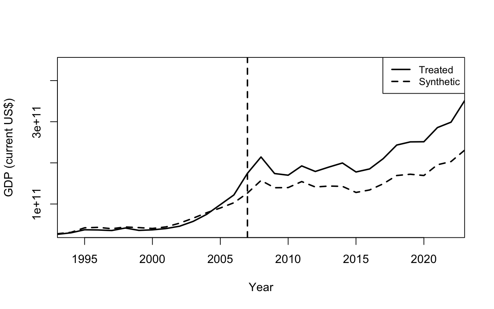

# Romania's Ascension to the EU: A Synthetic Control Approach.
 
## Results

## Data Sources
World Bank Open Data. (2015a). GDP (current US$). World Bank Open Data. https://data.worldbank.org/indicator/NY.GDP.MKTP.CD?locations=RO-CZ-BG
World Bank Open Data. (2015b). General government final consumption expenditure (% of GDP). World Bank Open Data. https://data.worldbank.org/indicator/NE.CON.GOVT.ZS?locations=RO-CZ-BG
World Bank Open Data. (2024a). Exports of goods, services and primary income (BoP, current US$). World Bank Open Data. https://data.worldbank.org/indicator/BX.GSR.TOTL.CD?locations=RO-CZ-BG
World Bank Open Data. (2024b). Foreign direct investment, net inflows (% of GDP). World Bank Open Data. https://data.worldbank.org/indicator/BX.KLT.DINV.WD.GD.ZS?locations=RO-CZ-BG
World Bank Open Data. (2024c). Inflation, consumer prices (annual %). World Bank Open Data. https://data.worldbank.org/indicator/FP.CPI.TOTL.ZG?locations=RO-CZ-BG
World Bank Open Data. (2024d). Inflation, consumer prices (annual %). World Bank Open Data. https://data.worldbank.org/indicator/FP.CPI.TOTL.ZG?locations=RO-CZ-BG
World Bank Open Data. (2024e). Unemployment, total (% of total labor force) (national estimate). World Bank Open Data. https://data.worldbank.org/indicator/SL.UEM.TOTL.NE.ZS?locations=RO-CZ-BG
